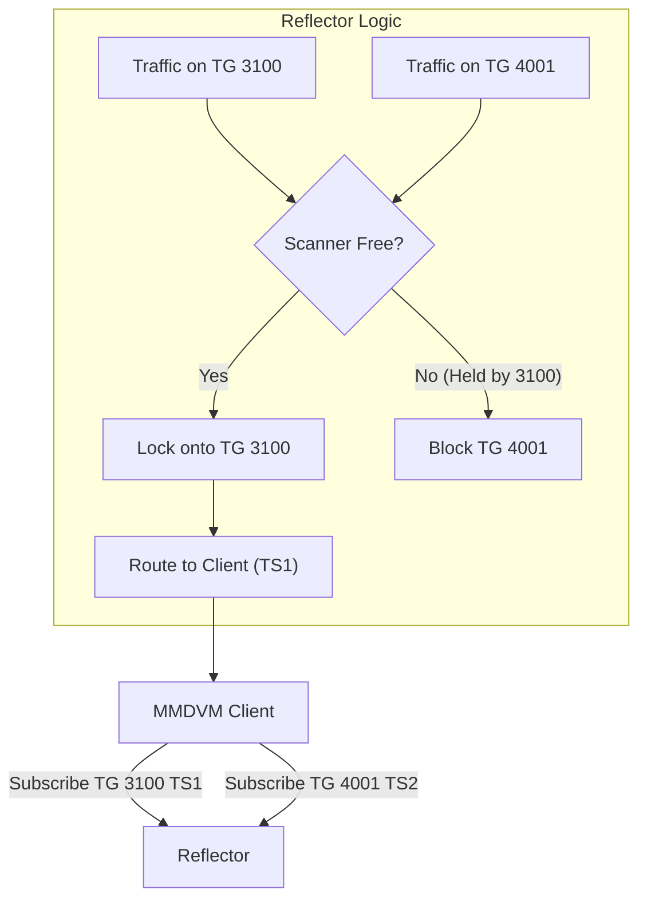

# Flexible DMR Mode (Mini DMR) User Guide

URFD now supports a "Flexible DMR" mode (often called "Mini DMR"), which changes how DMR clients interact with the reflector. Unlike the legacy "XLX" mode where clients link to a specific module (A-Z) and traffic is bridged, Mini DMR mode allows clients to directly subscribe to Talkgroups (TG).

## How it Works

In Mini DMR mode, the reflector acts like a **Scanner**.

1. **Subscriptions**: You "subscribe" to one or more Talkgroups on a Timeslot (TS1 or TS2).
2. **Scanning**: The reflector monitors all your subscribed Talkgroups.
3. **Hold Time**: When a Talkgroup becomes active (someone speaks), the scanner "locks" onto that Talkgroup for the duration of the transmission plus a **Hold Time** (default 5 seconds). During this hold, traffic from other Talkgroups is blocked to prevent interruption.



### Strict Timeslot Routing

The reflector enforces strict routing based on your subscription:

* If you subscribe to **TG 3100 on TS1**, traffic for TG 3100 will **only** be sent to your radio on **Timeslot 1**.
* If you subscribe to **TG 4001 on TS2**, traffic for TG 4001 will **only** be sent to your radio on **Timeslot 2**.
* This allows a single client to monitor different Talkgroups on different Timeslots simultaneously (if the Scanner is not held by one).

## Configuration

To enable Mini DMR mode, update your `urfd.ini` (or configuration file) in the `[DMR]` section:

```ini
[DMR]
; Disable legacy XLX behavior (REQUIRED for Dashboard Subscription View)
XlxCompatibility=false

; Optional: enforce single subscription per timeslot (default false)
SingleMode=false

; Scanner Hold Time in seconds (default 5)
HoldTime=5

; Dynamic Subscription Timeout in seconds (default 600 / 10 mins)
; 0 = Infinite
DefaultTimeout=600

; Module to Talkgroup Mapping (Optional)
; Maps Module A to TG 4001, B to 4002, etc. automatically.
; You can override specific maps:
MapA=4001
MapB=4002

; IMPORTANT: Any module you map (e.g. A, B) MUST be enabled in the [Modules] section!
; If Module A is not enabled, traffic for TG 4001 will be dropped.
```

## Usage

### 1. Subscribing via PTT (Push-To-Talk)

The easiest way to subscribe to a Talkgroup is to simply **transmit** on it from your radio.

* **Action**: Key up (PTT) on `TG 1234`.
* **Result**: The reflector detects your transmission and automatically subscribes you to `TG 1234` for the configured timeout duration (e.g., 10 minutes).
* **Renewal**: If you are already subscribed, keying up again will **reset the timeout timer** back to the full duration.
* **Note**: The first transmission might be muted (Anti-Kerchunk) to prevent noise, but you will immediately be subscribed.

### 2. Subscribing via Options String

You can manage subscriptions sent from your MMDVM hotspot/repeater configuration (or Pi-Star Options field).

* **Format**: `TS1=TG_ID;TS2=TG_ID;AUTO=TIMEOUT`
* **Example**: `TS2=3100,4001;AUTO=600`
  * Subscribes Timeslot 2 to TG 3100 and TG 4001.
  * Sets timeout to 600 seconds.

### 3. Disconnecting / Unsubscribing

* **Disconnect All**: Transmit a Group Call to **TG 4000**. This clears all dynamic subscriptions on that timeslot.
* **Single Mode**: If `SingleMode=true` is set in config, transmitting on a *new* Talkgroup automatically unsubscribes you from the previous one.

### 4. Talkgroup 9 (Reflector)

* Traffic on **TG 9** is treated as local reflector traffic (linked functionality) if the client is essentially "linked" to a module, but in Mini DMR mode, TG 9 behavior depends on the specific map configuration or defaults. Typically, use specific Talkgroups for wide-area routing.

## Dashboard

The URFD Dashboard includes a dedicated **DMR** page (`/dmr`) to monitor Flexible DMR Mode activity.

* **Active Subscriptions**: Shows all Talkgroups a client is monitoring, along with the specific Timeslot.
* **Timers**: Displays a real-time countdown for Dynamic Subscriptions. Static subscriptions are marked as `Static`.
* **DMR ID**: Displays the client's DMR ID alongside their callsign (e.g., `CALLSIGN (3100123)`).
* **Requirements**: The dashboard requires NO additional configuration. It automatically displays data once `XlxCompatibility=false` is set in the backend config.

## Troubleshooting

### "Recordings are blank" or "No Traffic on other modes"

If clients can connect and transmit but you see no traffic on other protocols (M17, YSF) or blank recordings:

* **Check Modules**: Ensure the mapped Module (e.g. A for TG 4001) is defined and **enabled** in your `[Modules]` configuration.
* **Log Check**: Look for `Can't find module 'X' for Client ...` errors in the reflector log.
