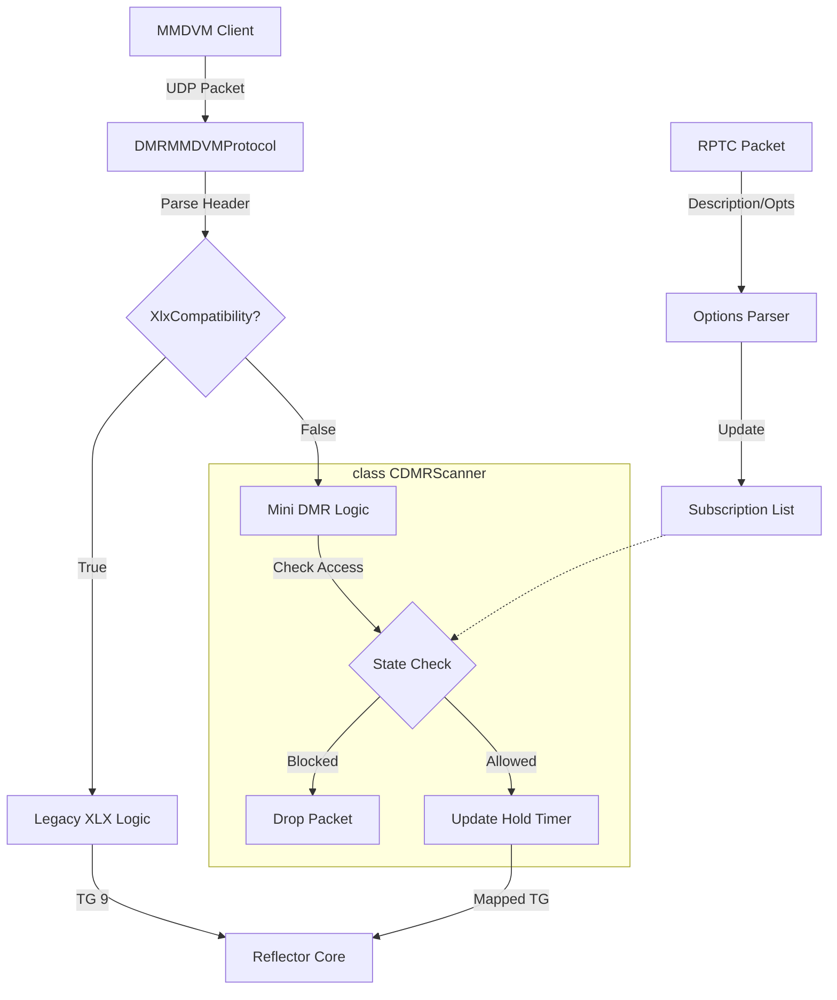

# Investigation and Fix Plan: Flexible DMR Mode

## Problem Description

User wants to support two modes of operation for DMR:

1. **XLX Mode** (Default): Legacy behaviors. MMDVM clients "link" to a module.
2. **Mini DMR Mode** (New): MMDVM clients do not "link". Modules are mapped to Talkgroups. Clients "subscribe" to TGs.

## Analysis

- **Modes**:
  - `XLXCompatibility`: Legacy mode.
  - `Mini DMR Mode`: Direct TG mapping.
- **Subscription Logic**:
  - **Single Mode**: Only one TG allowed per timeslot. New TG replaces old.
  - **Multi Mode**: Multiple subscriptions allowed per timeslot.
  - **Scanner / Hold**: If >1 subscription, hold onto active TG for X seconds (default 5s) after idle before switching.
- **Timeouts**:
  - Dynamic subscriptions expire after configurable time (default 10 mins).
  - Configurable per connection via Options string/password.
  - Static subscriptions (via config/options) do not expire.
- **Scope**:
  - Only TGs defined in the Reflector's Module Map (plus 4000) are valid.
- **Anti-Kerchunk**:
  - If a client Subscribes via PTT (first time), ignore/mute that transmission to prevent broadcasting unnecessary noise.

## Proposed Changes

### Configuration

- [ ] Modify `JsonKeys.h` / `Configure.h` / `Configure.cpp`:
  - `Dmr.XlxCompatibility` (bool, default true).
  - `Dmr.ModuleMap` (map/object).
  - `Dmr.SingleMode` (bool, default false).
  - `Dmr.DefaultTimeout` (int, default 600s).
  - `Dmr.HoldTime` (int, default 5s).

### Client State (`DMRMMDVMClient`)

- [ ] Add `Subscription` structure:
  - `TalkgroupId`
  - `Timeslot`
  - `Expiry` (timestamp or 0 for static)
- [ ] Add `ScannerState`:
  - `CurrentSpeakingTG`
  - `HoldExpiry`
- [ ] Add `Subscriptions` container (list/map).

### Reflector Logic (`DMRMMDVMProtocol.cpp`)

- [ ] **Options Parsing**:
  - Parse "Options" string (e.g., `TS1=4001;AUTO=600`) from RPTC Description/Password.
- [ ] **Incoming Packet (`OnDvHeaderPacketIn`)**:
  - If `!XlxCompatibility`:
    - **Validate**: TG must be in `ModuleMap` or 4000.
    - **Unsubscribe**: If TG 4000, remove subscription (or all depending on logic).
    - **Subscribe**:
      - Thread-safe update of subscriptions via `CDMRScanner`.
      - **First PTT Logic**: If this is a *new* dynamic subscription, flag stream as `Muted` or don't propagate.
- [ ] **Outgoing/Queue Handling (`HandleQueue`)**:
  - Filter logic:
    - Thread-safe check of `CheckPacketAccess(tg)`.
    - Scanner Logic handled internally in `CDMRScanner` with mutex protection.

## Architecture Diagram



## Cross-Protocol Traffic Flow (Outbound)

```mermaid
graph TD
    Src[Source Protocol e.g. YSF] -->|Audio on Module B| Core[Reflector Core]
    Core -->|Queue Packet| DMRQueue[DMRMMDVMProtocol::HandleQueue]
    
    subgraph "Handle Queue Logic"
        DMRQueue --> Encode1[Encode Buffer TS1]
        DMRQueue --> Encode2[Encode Buffer TS2]
        
        Encode1 --> ClientCheck{Client Subscribed?}
        Encode2 --> ClientCheck
        
        ClientCheck -->|TG + TS1| Send1[Send TS1 Buffer]
        ClientCheck -->|TG + TS2| Send2[Send TS2 Buffer]
        ClientCheck -->|No| Drop[Drop]
    end
    
    Send1 --> Client[MMDVM Client]
    Send2 --> Client
```    %% Mini DMR Logic
    MapLookup -->|Yes| Map[Map Module B -> TG 4002]
    Map -->|TG 4002| ScannerCheck{Scanner Check}
    
    subgraph CDMRScanner
        ScannerCheck -->|Client Subscribed?| SubCheck{Subscribed?}
        SubCheck -->|No| Drop[Drop]
        SubCheck -->|Yes| HoldCheck{Hold Timer Active?}
        
        HoldCheck -->|Held by other TG| Drop
        HoldCheck -->|Free / Same TG| Allowed[Allow]
    end
    
    Allowed --> SendMini[Send UDP Packet TG 4002]
```

## Architecture Decision

- **Unified Protocol Class**: We will keep `DMRMMDVMProtocol` as the single class handling the UDP/DMR wire protocol.
  - **Reasoning**: Both "XLX" and "Mini DMR" modes share identical packet structures, parsing, connection handshakes (RPTL/RPTK), and keepalive mechanisms. Splitting them would require either duplicating this transport logic or creating a complex inheritance hierarchy.
- **Logic Separation**: instead of polluting `DMRMMDVMProtocol.cpp` with mixed logic:
  - **Legacy/XLX Logic**: Remains inline (simple routing 9->9).
  - **New/Mini Logic**: Encapsulated in `CDMRScanner`. The Protocol class will call checking methods on the scanner.
  - **Toggle**: A simple `if (m_XlxCompatibility)` check at the routing decision points (packet ingress/egress) will switch behavior.

## Safety & Robustness Logic

- **Concurrency**:
  - `CDMRScanner` will encapsulate all state (`Subscriptions`, `HoldTimer`, `CurrentTG`) protected by an internal `std::recursive_mutex`.
  - **Deadlock Prevention**: `CDMRScanner` methods will be leaf-node operations (never calling out to other complex locked systems).
  - Access to `CDMRScanner` from `DMRMMDVMProtocol` will be done via thread-safe public methods only.
- **Memory Safety**:
  - Avoid raw `char*` manipulation for Options parsing; use `std::string`.
  - Input Description field will be clamped to `RPTC` max length (checked in `IsValidConfigPacket` before parsing).
  - No fixed-size buffers for variable lists (use `std::vector` for TGs).

## Testing Strategy (TDD)

- **Objective**: Verify complex logic (Subscription management, Timeout, Scanner checks) in isolation without needing full network stack (mocking `DMRMMDVMProtocol/Client`).
- **Plan**:
  - Create `reflector/DMRScanner.h/cpp` (or similar) to encapsulate the logic:
    - `class CDMRScanner`:
      - `AddSubscription(tg, ts, timeout)`
      - `RemoveSubscription(tg, ts)`
      - `IsSubscribed(tg)`
      - `CheckPacketAccess(tg)` -> Validates against Hold timer & Single Mode.
      - **Safety Tests**: Verify behavior under high-concurrency (if possible in unit test) or logic edge cases.
  - Create `reflector/test_dmr.cpp`:
    - A standalone test file similar to `test_audio.cpp`.
    - **Scenarios**:
            1. **Single Mode**: Add TG1, Add TG2 -> Assert TG1 removed.
            2. **Scanner Hold**: Packet from TG1 accepted. Immediately Packet from TG2 -> Rejected (Hold active). Wait 5s -> Packet from TG2 Accepted.
            3. **Timeout**: Add TG dynamic (timeout 1s). Wait 2s -> Assert TG removed.
            4. **Options Parsing**: Feed "TS1=1,2;AUTO=300" string -> Verify Subscriptions present.
            5. **Buffer Safety**: Feed malformed/oversized Option strings -> Verify no crash/leak.
  - **Build**: Add `test_dmr` target to `Makefile`.

## Verification Plan

- [ ] **Run TDD Tests**: `make test_dmr && ./reflector/test_dmr`
- [ ] **Manual Verification**:
  - **Test Configurations**:
    - Single Mode: Verify PTT on TG A drops TG B.
    - Multi Mode: Verify PTT on A adds A (keeping B).
  - **Test Scanner**:
    - Sub to A and B. Transmit on A. Verify B is blocked during Hold time.
  - **Test Timeout**:
    - Set short timeout. Verify subscription drops.
  - **Test Kerchunk**:
    - PTT on new TG. Verify not heard by others. Second PTT heard.
