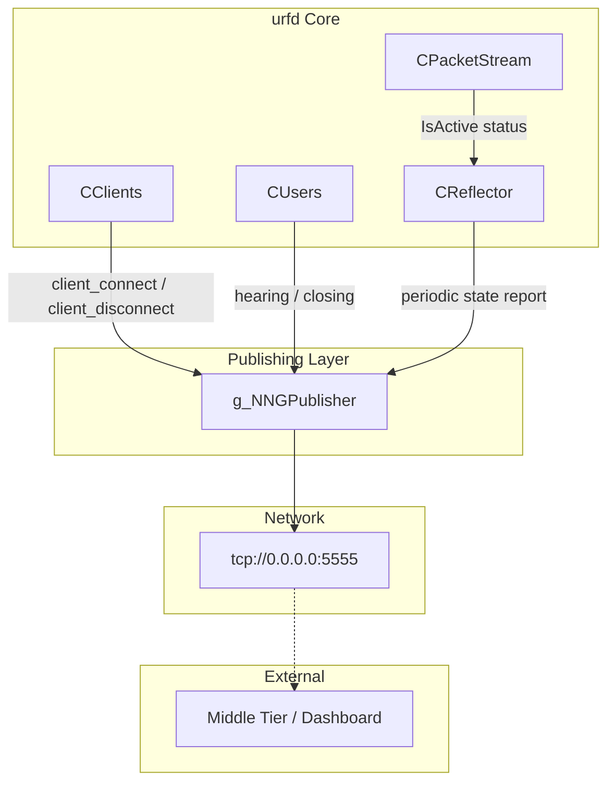

# NNG Event System Documentation

This document describes the real-time event system in `urfd`, which uses NNG (nanomsg next gen) to broadcast system state and activity as JSON.

## Architecture Overview

The `urfd` reflector acts as an NNG **Publisher** (PUB). Any number of subscribers (e.g., a middle-tier service or dashboard) can connect as **Subscribers** (SUB) to receive the event stream.



## Messaging Protocols

Events are sent as serialized JSON strings. Each message contains a `type` field to identify the payload structure.

### 1. State Broadcast (`state`)

Sent periodically based on `DashboardInterval` (default 10s). It provides a full snapshot of the reflector's configuration and status.

**Payload Structure:**

```json
{
  "type": "state",
  "Configure": {
    "Key": "Value",
    ...
  },
  "Peers": [
    {
      "Callsign": "XLX123",
      "Modules": "ABC",
      "Protocol": "D-Extra",
      "ConnectTime": "2023-10-27T10:00:00Z"
    }
  ],
  "Clients": [
    {
      "Callsign": "N7TAE",
      "OnModule": "A",
      "Protocol": "DMR",
      "ConnectTime": "2023-10-27T10:05:00Z"
    }
  ],
  "Users": [
    {
      "Callsign": "G4XYZ",
      "Repeater": "GB3NB",
      "OnModule": "B",
      "ViaPeer": "XLX456",
      "LastHeard": "2023-10-27T10:10:00Z"
    }
  ],
  "ActiveTalkers": [
    {
      "Module": "A",
      "Callsign": "N7TAE"
    }
  ]
}
```

### 2. Client Connectivity (`client_connect` / `client_disconnect`)

Triggered immediately when a client (Repeater, Hotspot, or Mobile App) links or unlinks from a module.

**Payload Structure:**

```json
{
  "type": "client_connect",
  "callsign": "N7TAE",
  "ip": "1.2.3.4",
  "protocol": "DMR",
  "module": "A"
}
```

### 3. Voice Activity (`hearing`)

Triggered when the reflector "hears" an active transmission. This event is sent for every "tick" or heartbeat of voice activity processed by the reflector.

**Payload Structure:**

```json
{
  "type": "hearing",
  "my": "G4XYZ",
  "ur": "CQCQCQ",
  "rpt1": "GB3NB",
  "rpt2": "XLX123 A",
  "module": "A",
  "protocol": "M17"
}
```

### 4. Transmission End (`closing`)

Triggered when a transmission stream is closed (user stops talking).

**Payload Structure:**

```json
{
  "type": "closing",
  "my": "G4XYZ",
  "module": "A",
  "protocol": "M17"
}
```

## Middle Tier Design Considerations

1. **Late Joining**: The `state` message is broadcast periodically to ensure a middle-tier connecting at any time (or reconnecting) can synchronize its internal state without waiting for new events.
2. **Active Talkers**: The `ActiveTalkers` array in the `state` message identifies who is currently keyed up. Real-time transitions (start/stop) are driven by the `hearing` events and the absence of such events over a timeout (typically 2-3 seconds).
3. **Deduplication**: The `state` report is a snapshot. If the middle-tier is already tracking events, it can use the `state` report to "re-base" its state and clear out stale data.
